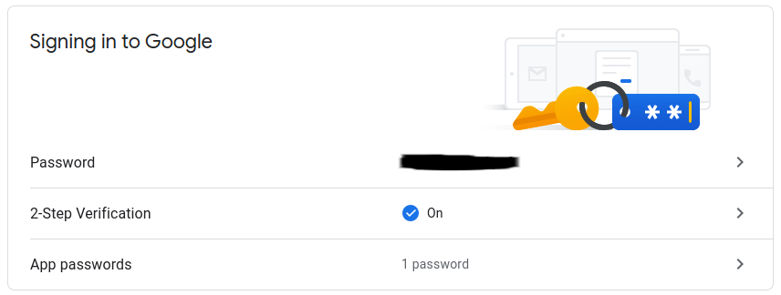

# Surveillance-PI
### Surveillance camera with a Raspberry Pi

This project uses a raspberry pi with a pi camera to create a surveillance system.
The script I wrote uses computer vision to detect motion in a scene.
If a motion is detected, a notification email will be sent with the attached image file.

### Hardware

You need a raspberry pi, a micro sd card with raspberry pi OS Desktop installed and a raspberry pi camera.

### Setup

To be able to send emails, you will also need a Gmail account (better to create a new one for security) and follow these steps to create a Google App password:
- go to [security settings](https://myaccount.google.com/security)
- 
- activate 2-Step Verification
- go to App passwords
- click on "Select app" then click on "Other (Custom name)" and give it a name you like
- 
- click on "GENERATE" and a 16 character password will appear
- edit SurveillancePI.py script and add sender email, receiver email and the password you have just generated
- 

Now you can open a terminal and launch the setup script by typing "sudo bash setup.sh", this will take some hours so be patient

Remember to activate the pi camera!
- open a terminal
- type sudo raspi-config
- go to interface options
- go to camera and enable it

### Script instructions

SurveillancePI, program created by David Forino AI Solutions
(https://davidforino-aisolutions.com). Make your house safer with a
surveillance system using a Raspberry Pi! If it detects a motion above a
specified threshold, it sends you a notification email with the picture.
BEFORE USING THIS PROGRAM, REMEMBER TO ADD THE EMAIL DETAILS!

optional arguments:
-  -h, --help            show this help message and exit
-  -b, --bounding_box    Enable bounding box drawing on original image
-  -s, --show            Show the image live on screen
-  --threshold THRESHOLD Threshold value to detect a motion
-  --max_fps MAX_FPS     Maximum FPS desired value
-  --pause PAUSE         Initial pause before running the script (seconds)
-  --min_area MIN_AREA   Minimum area considered when creating bounding boxes
-  --email_timer EMAIL_TIMER Number of seconds before a notification email is sent, if value is negative no email will be sent
